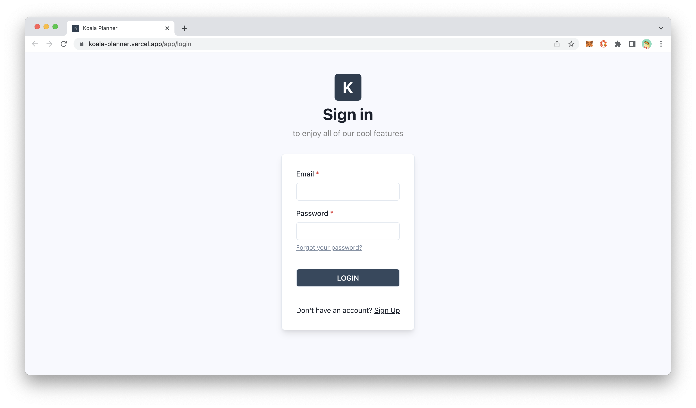

# Koala Planner

Who says Koalas aren't hardworking?

Koala Planner is a koala-themed planner that aims to give users a seamless experience when organising their tasks, by removing the unnecessary details so that they can focus better on their task at hand.

## Motivation

Over the years of education, we as students have tried out countless ways to keep track of the never-ending flow of homework, assignments, project deadlines and so on. And we all know how important it is to have a good management system in order to achieve that.

As such, we wanted to challenge ourselves by building and customising our very own task management application - taking what we like about commonly-used applications, and improving on what we dislike.

## Implementation

Koala Planner uses ReactJS for the frontend development and JavaScript for the main logic of the web app. NodeJS is used as the JavaScript runtime environment for our local development environment.

Supabase was chosen as an alternative from using Firebase for its ease of setup and configuration to our needs. The database is used for user authentication and storing relevant account information such as username, avatar image and tasks.

## Set Up Guide

1. Clone repository
2. Run `npm install` to install project dependencies
3. Run `npm start` to start the application
4. Use test account `email: user@example.com | password: user123`

Alternatively, visit [http://koala-planner.vercel.app/](http://koala-planner.vercel.app/).

## More Information

For more information about our project, check out this [folder](https://github.com/danielk0k/KoalaPlanner/tree/main/assets) which contain our project poster and demo video.

## Acknowledgements

This project was part of an independent summer project. You may view the project submission page [here](https://nusskylab-dev.comp.nus.edu.sg/public_views/public_projects).

By Daniel Kok and Grace Yeh
